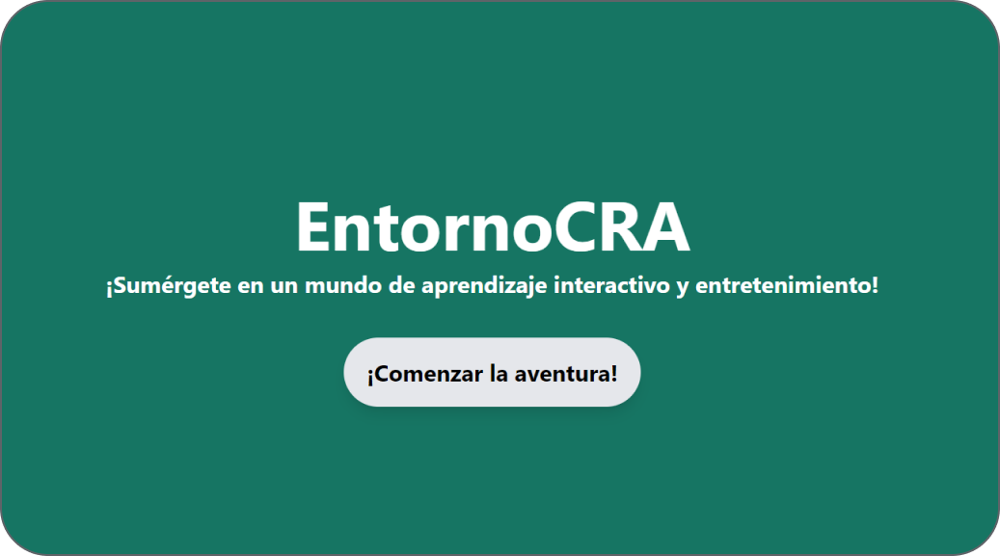
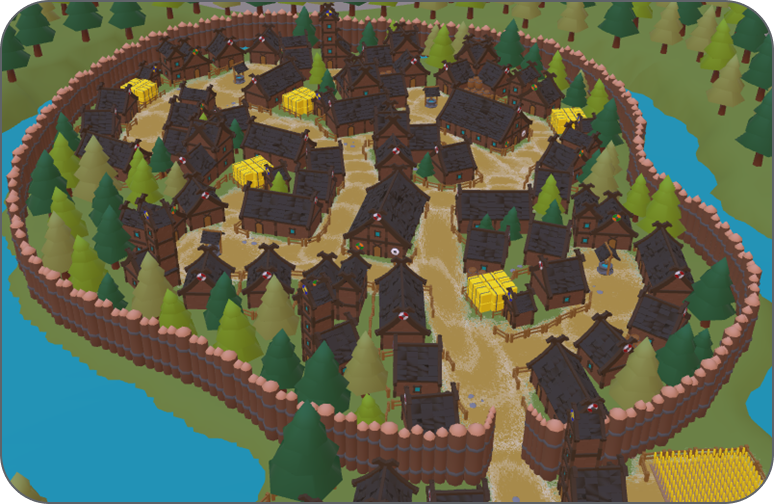
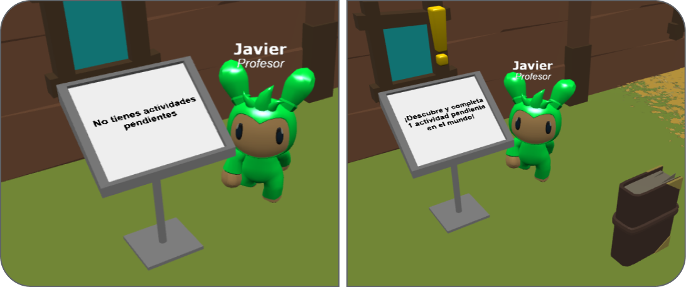
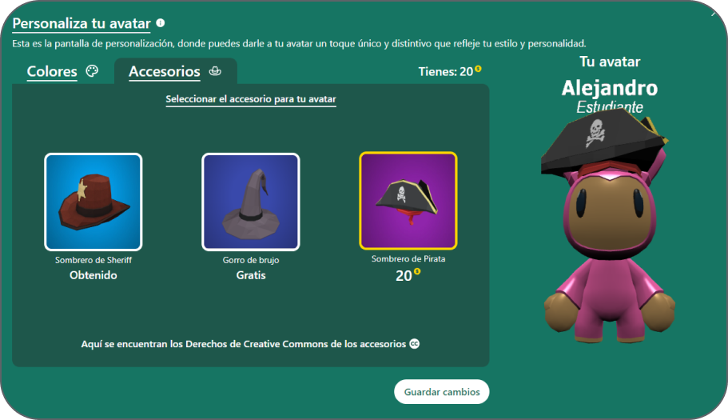

# Trabajo de Fin de Grado - Alejandro Navarro de la Cruz 
## Desarrollo de un Entorno Gráfico Interactivo aplicado a la Educación

Este repositorio contiene el código fuente y los recursos asociados con un entorno gráfico interactivo desarrollado con Babylon.js. El objetivo principal de este proyecto es proporcionar una herramienta educativa dónde profesores y estudiantes puedan crear y realizar actividades en este mundo virtual.

### Contexto del sistema
El sistema se enmarca en el contexto educativo de los alumnos de infantil y primaria del Colegio Rural Agrupado Sierra de Alcaraz, con el objetivo de enriquecer visualmente el [entorno actual de TecnoCRA](https://tecnocra.i3a.uclm.es/intecra/electron#)
 se pretende crear un prototipo de un entorno gráfico en 3D interactivo.

### Tecnologías Utilizadas
Para el desarrollo de este proyecto, se han utilizado una variedad de tecnologías que permiten construir una aplicación web robusta y eficiente. A continuación se presenta una lista de las principales tecnologías utilizadas:

<div align="center">
<p align="center">
    <table style="margin: 0 auto; border-collapse: collapse;">
        <tr>
            <td style="text-align:center; padding: 20px;">
                
                <p style="margin-top: 10px;">HTML</p>
                <p style="margin-top: 10px;"><a href="https://www.w3.org/html/" target="_blank"></a></p>
            </td>
            <td style="text-align:center; padding: 20px;">
                
                <p style="margin-top: 10px;">CSS</p>
                <p style="margin-top: 10px;"><a href="https://www.w3.org/Style/CSS/" target="_blank"></a></p>
            </td>
            <td style="text-align:center; padding: 20px;">
                
                <p style="margin-top: 10px;">JavaScript</p>
                <p style="margin-top: 10px;"><a href="https://developer.mozilla.org/en-US/docs/Web/JavaScript" target="_blank"></a></p>
            </td>
            <td style="text-align:center; padding: 20px;">
                
                <p style="margin-top: 10px;">Socket.io</p>
                <p style="margin-top: 10px;"><a href="https://socket.io/" target="_blank"></a></p>
            </td>
            <td style="text-align:center; padding: 20px;">
                
                <p style="margin-top: 10px;">React</p>
                <p style="margin-top: 10px;"><a href="https://reactjs.org/" target="_blank"></a></p>
            </td>
        </tr>
        <tr>
            <td style="text-align:center; padding: 20px;">
                
                <p style="margin-top: 10px;">BabylonJS</p>
                <p style="margin-top: 10px;"><a href="https://www.babylonjs.com/" target="_blank"></a></p>
            </td>
            <td style="text-align:center; padding: 20px;">
                
                <p style="margin-top: 10px;">NodeJS</p>
                <p style="margin-top: 10px;"><a href="https://nodejs.org/" target="_blank"></a></p>
            </td>
            <td style="text-align:center; padding: 20px;">
                
                <p style="margin-top: 10px;">ExpressJS</p>
                <p style="margin-top: 10px;"><a href="https://expressjs.com/" target="_blank"></a></p>
            </td>
            <td style="text-align:center; padding: 20px;">
                
                <p style="margin-top: 10px;">MongooseJS</p>
                <p style="margin-top: 10px;"><a href="https://mongoosejs.com/" target="_blank"></a></p>
            </td>
            <td style="text-align:center; padding: 20px;">
                
                <p style="margin-top: 10px;">MongoDB</p>
                <p style="margin-top: 10px;"><a href="https://www.mongodb.com/" target="_blank"></a></p>
            </td>
        </tr>
    </table>
</p>
</div>

## Capturas de pantalla






## Funcionalidades del sistema
A continuación se presentan algunas de las principales funcionalidades del sistema:

1. 👨‍🏫 Gestión de roles (Profesor / Estudiante).
2. 🌐 Exploración del mundo virtual interactivo.
3. 💥 Colisión con los elementos del entorno 3D.
4. 🎮 Movimiento virtual con teclado y joystick.
5. 📷 Control del movimiento de la cámara.
6. 🛠️ Creación y modificación de actividades en el mundo virtual.
7. ✏️ Realización de las actividades en el mundo virtual.
8. 🎨 Personalización de la apariencia del avatar en el mundo virtual.
9. 📫 Comunicación privada entre usuarios.

## Instalación [](https://www.npmjs.com/package/npm) 


Para utilizar este proyecto, sigue los siguientes pasos:

1. **Clona el repositorio en tu máquina local:**
    ```
    git clone https://github.com/username/repo.git
    ```

2. **Instala las dependencias del proyecto:**
    ```
    npm install
    ```
    
3. **Inicia el servidor de desarrollo:**
    ```
    npm run devS 
    ```

4. **Ejecuta el servidor de desarrollo de Vite en otra terminal:**
    ```
    npm run devC  
    ```

5. **Abre tu navegador y accede a** `http://localhost:5172` **para ver la aplicación en funcionamiento.**

# 

<p align="center">
  
</p>
